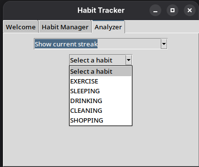

# Habit Tracker App

A python app to work create and manage habits. It creates daily and weekly habit objects and manages it.  Managing include check-off, deactivation, activation and deletion. It also allows analyzing the habits.

## Table of Contents

- [Features](#features)
- [Installation](#installation)
- [Usage](#usage)
- [Examples](#examples)
- [Testing](#testing)
- [Contributing](#contributing)
- [License](#license)
- [Contact](#contact)

## Features

- Create habit with name,description and periodicity
- Check-off habit,deactivate/activate and delete habit
- HabitAnalyzer to perform analysis
- Json database for storing and retrieving data
- Documnented and easy to follow code


## Installation

> [!NOTE]
> Make sure you have python 3.13 installed on your system.


**Clone the repo**  
   ```bash
   git clone https://github.com/soumyarajde/HabitTracker.git
   cd HabitTracker
   ```
**Create and activate a virtual enivironment**
```bash
python3 -m venv venv
source venv/bin/activate
 ```

To install the 'habittracker' library and the app use the following pip command:
   ```bash
   pip install .
 
  ```


## Usage

1.Run the main script
   ```bash
   python main.py

   ```
Application window with multiple tabs opens when user runs the main.py file.

### Welcome Tab
Welcome tab reminds the user about pending habits.


### Habit Manager Tab
Habit Manager tab allows creating habits and
managing habits.


#### Creating a Habit
On clicking create new input fields for *Name*, *Description*, and *Periodicity* will appear.Enter all fields and click create button to create a habit and update the database.


#### Habit Management
Clicking on *View* shows the habit management options.Click on the button to perform the required fucntion.


### Analyzer Tab
By clicking on the *Analyzer* tab,you can get various information about the habit such as current streak,longest streak,etc. This tab shows a drop-down which lists various analysis options. You have to select one. When user select option for streak it shows another drop-down with habit names. User have to select the habit from the list for which analysis is to be done.




## Examples
Example for habit creation and management using HabitManager class
```python
from habittracker.habitmanager import HabitManager
manager=HabitManager()
# create habit
manager.create_habit(name="Reading",description="30mins",periodicity="daily")
print(manager.get_habit("Reading"))
# check-off habit
manager.check_off("Reading")
# deactivate habit
manager.deactivate_habit("Reading")
#delete habit
manager.delete_habit("Reading")
```


## Testing

> [!NOTE]
> Make sure you have pytest and pytest-cov installed on your system.


The Application comes with a suite of tests.To run them,
Run the command
   ```bash
   pytest tests

   ```
To see test coverage, run this
   ```bash
   pytest --cov=habittracker --cov-report=xml tests/

   ```

Ensure all tests pass to verify the functionality of app on your system.

> [!IMPORTANT]
> Testing was performed only on Linux.

## Contributing

Contributions are welcome!
If you find any issues or have feature requests,please open an issue on our GitHub repository or open a pull request.

## License

Distributed under the MIT License.

## Contact

Soumya Raj - soumya.raj.de@gmail.com

Project Link: https://github.com/soumyarajde/HabitTracker/


